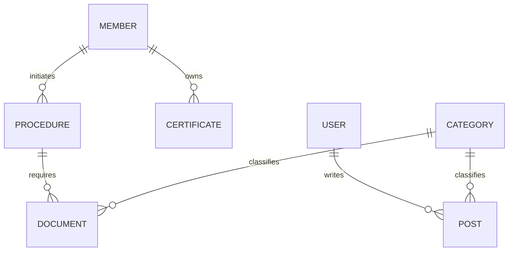

# Technical Requirements Document (TRD): Portal Crolimacallao

## 1. Technology Stack

The project will be built using the **Laravel** ecosystem to ensure security, scalability, and developer efficiency.

- **Backend:** Laravel 11.x (latest stable)
- **Frontend:** Laravel Blade with Tailwind CSS v4 or Livewire for reactive components.
- **Database:** MySQL 8.0+ or PostgreSQL.
- **Cache & Sessions:** Redis (for high performance).
- **File Storage:** AWS S3 or Local Storage (via Laravel Flysystem) for documents and uploads.
- **Search (Optional):** Meilisearch or Algolia (via Laravel Scout).
- **Auth:** Laravel Breeze or Filament (for complex admin panels).

---

## 2. System Architecture

### 2.1 Monolithic Architecture with Modular Design
The portal will use a standard Laravel monolithic approach, keeping the frontend (Blade) and backend together for simplicity, while logically separating core domains:
- `App\Models\Member`: Handles professional data.
- `App\Models\Document`: Handles normative and institutional files.
- `App\Models\Procedure`: Logic for Colegiatura, Habilitación, etc.

### 2.2 Integration Points
- **Member Database:** Synchronize or interface with the existing "Portal del Colegiado" database.
- **Moodle:** SSO (Single Sign-On) integration or deep-linking with the training platform.
- **Mesa de Partes:** Custom API layer to handle file uploads and status tracking.

---

## 3. Data Model (Key Entities)

### 3.1 Primary Entities
- **User:** Authentication and RBAC (Roles: Super Admin, Editor, Member, Public).
- **Member:** Extended profile (COP number, Habilitation status, Specialty).
- **Post:** News and events content.
- **Procedure:** Tracking entries for administrative requests.

---

## 4. Security Requirements

- **Data Privacy:** Implementation of encryption for sensitive fields (DNI, phone numbers) using Laravel's encryption services.
- **Authentication:** MFA (Multi-Factor Authentication) for Administrator accounts.
- **Authorization:** Granular permissions via Laravel Gates or Spatie Permissions.
- **File Security:** Scanned uploads, restricted MIME types (PDF, JPG, PNG only), and private disk storage for personal documents.
- **Integrity:** HTTPS enforcement via HSTS and robust CSRF protection (native in Laravel).

---

## 5. Performance & Infrastructure

- **Server:** Nginx/Apache on a Linux-based VPS or Cloud Instance.
- **Optimization:**
  - Route and Config caching.
  - Image optimization (Spatie Media Library).
  - Lazy loading for heavy assets.
- **SEO Ready:** Integration of dynamic Meta tags, OpenGraph data, and automatic Sitemap generation.

---

## 6. Migration Strategy

1. **Audit:** Final inventory of the current PHP database tables.
2. **ETL Process:** Using Laravel Migrations and Seeders (or custom artisan commands) to extract, transform, and load legacy data into the new schema.
3. **URL Mapping:** 301 Redirection strategy using a Laravel Middleware or Nginx rules to preserve SEO juice from old `.php` routes.
